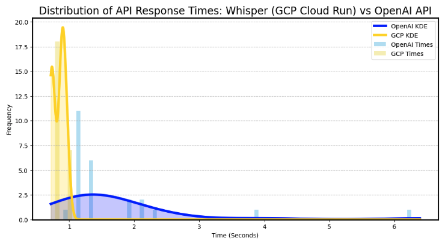

# Deploy-Whisper-On-GCP
In this example, I will document the steps to deploy the open AI whisper SOTA STT model on GCP cloud run with Docker. 

This is useful incase you want to ensure your data is stored on specific servers you are in control of, also, I found that given you are not experiencing a cold start, deploying whisper on GCP cloud run has generally faster and more predictable response times. GCP Cloud Run is more than twice the price compared to OpenAI API; however, this may be balanced based on the longer response times from OpenAI. 




## IMPORTANT NOTES
- You will need to request GPU access from GCP which can take up to 2 days for approval in order to deploy using GPU on cloud run. (ADD STEPS ON HOW TO DO THIS FIRST). For me this took about 4 businesses days. With that being said, GCP was very responsive, and gave me a status update almost every day which was helpful.
- Inference using the different whisper models on CPU, will be extremely slow, and basically not useful for most cases. 
- Whisper Cost: $0.006 / minute (rounded to the nearest second)
- GCP Cloud Run API with GPU Cost: $0.014 / minute
- Overall, the GCP deployed API has faster more consistent api response times. The average response times for this example of 25 requests for GCP is 0.83 seconds, while for OpenAI it is 1.75, so on average GCP was twice as fast. 
- It will cost a few cents a day, just to store the container image in the artifact registry in GCP. So if you need your costs to go fully down to 0, make sure to delete the image in the artifact registry. Deleting the cloud run API will not delete the image automatically. 

### Closing Intro Notes
Hosting whisper on GCP Cloud Run will cost more; however, the response times are faster and more consistent. GCP will allow more flexibility for server location and privacy of user data. There will be cold start times while hosting on GCP Cloud Run. 

Its important to consider the scale at which you plan to use the whisper API, if you plan having fewer users, privacy is important, and you require faster response times, GCP Cloud Run may be the better solution. If you plan on having many users, but can have variable response times, and privacy is not of concern, than the OpenAI API is the better solution. 

This documentation is a WIP!

## Steps

### Create new python venv
```bash
pyenv local 3.10.0

python -m venv venv

source venv/bin/activate
```

In order to install a different version of python, run:
```bash
# add the relevant version
pyenv install 3.__.__
```

### Install the whisper package (need to read through source code, to verify if data is being stored, and check if it can run offline)
    ```
    pip install --upgrade pip
    
    pip install -U openai-whisper

    ```

### Install FFMPEG
I already have it installed, and this is just for running the model locally, we will need to install ffmpeg within our env container as well. 

```
# From Open AI Docs: 

# on Ubuntu or Debian
sudo apt update && sudo apt install ffmpeg

# on Arch Linux
sudo pacman -S ffmpeg

# on MacOS using Homebrew (https://brew.sh/)
brew install ffmpeg

# on Windows using Chocolatey (https://chocolatey.org/)
choco install ffmpeg

# on Windows using Scoop (https://scoop.sh/)
scoop install ffmpeg
```

### Additional Installs 
Read the docs from Open AI, as they suggest you may need to install the Rust programming language as well as packages like tiktoken; however, this will depend on your machine. For this demo, I am running locally on MacOS. 

### Test 
Grab any audio file with speech, to test the model locally using the CLI tool: 
```
whisper 'your_audio.mp3' --model turbo -f "json"
```
This will save your transcription data into a json file in the current dir. 

## Writing the API
First I will start by making a simple endpoint which is only used to upload audio and check the file name and its length in bytes. 

### Install Fast API
```
pip install "fastapi[standard]" 

pip install uvicorn 

# required for file uploading with fast API (Why?)
python-multipart
```

### Python API Endpoint
For loading the audio into our API, we will utlize the fast API upload file method: https://fastapi.tiangolo.com/reference/uploadfile/ 


```python
import whisper
from fastapi import FastAPI, File, UploadFile, HTTPException
import subprocess
import tempfile
import shutil
import os
import torch

# POSSIBLE VERSIONS
# https://github.com/openai/whisper/tree/main
# 'tiny.en', 'tiny', 'base.en', 'base', 'small.en',
# 'small', 'medium.en', 'medium', 'large-v1', 'large-v2',
# 'large-v3', 'large', 'large-v3-turbo', 'turbo'
MODEL_VERSION = "large-v3-turbo"

# V3 models require 128 mel, other models like the tiny model require 80 mels
NUM_MELS = 128

app = FastAPI()

# Model loaded in docker file.
MODEL_PATH = f"/app/models/{MODEL_VERSION}.pt"
MODEL = whisper.load_model(MODEL_PATH)


def save_upload_file_to_temp(upload_file: UploadFile) -> str:
    with tempfile.NamedTemporaryFile(delete=False) as temp_file:
        upload_file.file.seek(0)
        shutil.copyfileobj(upload_file.file, temp_file)
        temp_file_path = temp_file.name
    return temp_file_path


@app.post("/check-gpu/")
async def check_gpu():
    if not torch.cuda.is_available():
        raise HTTPException(status_code=400, detail="CUDA is not available")
    return {"cuda": True}


@app.post("/check-ffmpeg/")
async def check_ffmpeg():
    ffmpeg = True
    try:
        subprocess.run(
            ["ffmpeg", "-version"],
            capture_output=True,
            text=True,
            check=True
        )
    except Exception as e:
        print(e)
        ffmpeg = False
    if not ffmpeg:
        raise HTTPException(status_code=400, detail="FFMPEG is not available")
    return {"ffmpeg": True}


@app.post("/check-model-in-memory/")
async def check_model_in_memory():
    """Verifies if model was loaded during docker build."""
    return {"contents": os.listdir("/app/models/")}


@app.post("/translate/")
async def translate(file: UploadFile = File(...)):
    temp_filepath = save_upload_file_to_temp(file)
    try:
        audio = whisper.load_audio(temp_filepath)
        audio = whisper.pad_or_trim(audio)
        mel = whisper.log_mel_spectrogram(
            audio, n_mels=NUM_MELS).to(MODEL.device)
        result = whisper.decode(MODEL, mel)
    finally:
        os.remove(temp_filepath)
    return {"text": result.text, "language": result.language}
```

Check the api locally in development mode: 
```
fastapi dev main.py
```

Navigate to this URL to check out your API:
```
http://127.0.0.1:8000/docs
```

Next click on the "try it out" button. 

Then go to the file upload, and upload an MP3 file, and hit the "Execute" button. 

This will make a request to the API, the output should be something like so:

```json
{
  "filename": "your_audio.mp3",
  "content_size": 724320,
  "ffmpeg": true
}
```

## Testing with Docker Locally
### Create the docker file
The two most important parts of the docker file, is that we use an image which loads CUDA, which is required for accessing the GPU. The second important part, is that our image has FFMPEG, which is an open source, highly capable, general purpose audio and video processing software, which is required often when working with audio data. 

```Dockerfile
# Updated Dockerfile which loads model in mem.
FROM pytorch/pytorch:2.0.0-cuda11.7-cudnn8-runtime

WORKDIR /app

COPY requirements.txt .

RUN pip install --no-cache-dir -r requirements.txt

RUN mkdir models

ENV MODEL_VERSION=large-v3-turbo
RUN mkdir -p /app/models && \
    python -c "import whisper; whisper.load_model('$MODEL_VERSION', download_root='/app/models')"

RUN apt-get update && \
    apt-get install -y ffmpeg && \
    apt-get clean && \
    rm -rf /var/lib/apt/lists/*

COPY main.py .

EXPOSE 8080

CMD ["uvicorn", "main:app", "--host", "0.0.0.0", "--port", "8080"]
```
The reason to load the model into memory in the container, is so that when the API scales down to 0, the model does not have to be reloaded in memory each time, which can take a minute, but rather, it will exist already when the server starts. So although this will not stop cold starts from happening, it will make the cold starts less bad. 


### Build the docker image
```BASH
docker build -t whisper-api .

# Reason for adding the platform flag, is that when trying to run the API locally, it can return a warning saying the base machine does not match what is required to run the container. 
docker run --name whisper-api-container -p 8080:8080 whisper-api 

# View the API now running within docker and test it again:
http://localhost:8080/docs

# Incase you want to delete the container, run:
docker rm -f /whisper-api-container
```

The container is about 9Gi of memory after the model is loaded inside.

IMPORTANT NOTE FOR RUNNING DOCKER LOCALLY ON MAC: 
https://i.sstatic.net/fJ6VG.png
If the container fails due to the local machines MacOS, try:
Settings -> Features in development -> Check "Use Rosetta for x86/amd64 emulation on Apple Silicon"

I was unable to build the image locally until I made this configuration update. 

## Deploying on Cloud Run

### Adding GPU Checks
Before deploying onto cloud run, I want to add a helper function, which can be used to validate if the GPU is connected and working.

```python
@app.post("/check-gpu/")
async def check_gpu():
    if not torch.cuda.is_available():
        raise HTTPException(status_code=400, detail="CUDA is not available")
    return {"cuda": True}
```

### Deploy API (GitHub Actions)

There is a pre-made GitHub actions workflow which can be used to deploy Cloud Run, which I would normally use; however, since GPU on cloud run is a relatively new feature, it is not yet supported with GitHub workflow. Therefore, this requires us to build the docker image and push the image to the artifact registry in GCP, through the GCP SDK. To Do this, we can use GitHub actions to run automated deployment scripts.

Deploy on cloud run can be somewhat involved, as it requires:
- Service accounts
- GitHub secrets
- Setting budget alerts
I have documented all these steps already in this repo: 
https://github.com/fentresspaul61B/Deploy-API-with-Large-Files-GCP-Cloud-Run

For the sake of brevity I will include the steps required, and not touch on the ones that are not required (like setting budget alerts). 

I suggest to eventually add budget alerts, as using APIs on GCP can lead to unexpected bills when mistakes are made, leading to large bills, and this is compounded by the fact we are also adding a GPU server instance. 

### Create new service account
Add these permissions:

| **Role Name**                     | **Description**                                                                                                             |
|-----------------------------------|-----------------------------------------------------------------------------------------------------------------------------|
| **Storage Object Viewer**         |    Grants access to agent to download and list items in a bucket.                                                           |
| **Service Account User**          |    Required for deploying to Cloud Run; allows the deploying service account to act as the runtime service account.         |
| **Cloud Run Developer**           |    Grants the agent access to deploy the API to Google Cloud Run.                                                           |
| **Artifact Registry Create-on-Push Writer**      |    Used to create an artifact, which is the stored Docker image in GCP.                                                     |

Create a new GitHub actions secret and name it: GCP_CREDENTIALS
Also add your GCP project ID: and name it GCP_PROJECT_ID.

### Checking API response times

Grab token from gcloud
```
gcloud auth print-identity-token
```

Navigate to postman:
- Switch the setting to "POST"
- Change to the form data
- Change to value to "file"
- Add the key to be "file"
- Then select to upload a test file
- Add token to bearer token
- Send

Also can check GPU and FFMPEG endpoints 

### Creating GitHub Actions Workflow for deployment
https://cloud.google.com/run/docs/configuring/services/gpu#gcloud

- Go to cloud run admin API: https://console.cloud.google.com/marketplace/product/google/run.googleapis.com?q=search&referrer=search&project=devaworld-282317
- Go to Quotas and system limits
- Search for "Total Nvidia L4 GPU allocation, per project per region" and find your region
- Click the box
- Hit edit
- Fill out the request information
- Wait a few days until you get confirmation that your quota is increased. 

Otherwise you will get this error: 
```
ERROR: (gcloud.beta.run.deploy) spec.template.spec.node_selector: This project must be allowed to access instances with attached GPU. Please request the GPU access by requesting a quota via your cloud console.
```

Workflow:
```YAML
name: Deploy to Cloud Run (WITH GPU)

on:
  push:
    branches:
      - main

env:
  GCP_PROJECT_ID: ${{ secrets.GCP_PROJECT_ID }}
  REGION: "us-central1"
  SERVICE_NAME: whisper-translate-gpu

jobs:
  build-and-deploy:
    runs-on: ubuntu-latest

    steps:
      - name: Checkout Code
        uses: actions/checkout@v3

      - name: Google Auth
        id: auth
        uses: 'google-github-actions/auth@v2'
        with:
          credentials_json: ${{ secrets.GCP_CREDENTIALS }}

      - name: Set up Cloud SDK
        uses: google-github-actions/setup-gcloud@v1
        with:
          project_id: ${{ env.GCP_PROJECT_ID }}
          install_components: beta
      
      - name: Authenticate Docker with Google Container Registry
        run: gcloud auth configure-docker

      - name: Build Docker Image
        run: |
          docker build -t gcr.io/${{ env.GCP_PROJECT_ID }}/${{ env.SERVICE_NAME }}:${{ github.sha }} -f Dockerfile .

      - name: Push Docker Image
        run: |
          docker push gcr.io/${{ env.GCP_PROJECT_ID }}/${{ env.SERVICE_NAME }}:${{ github.sha }}

      - name: Deploy to Cloud Run (WITH GPU)
        run: |
          gcloud beta run deploy ${{ env.SERVICE_NAME }} \
            --image gcr.io/${{ env.GCP_PROJECT_ID }}/${{ env.SERVICE_NAME }}:${{ github.sha }} \
            --region ${{ env.REGION }} \
            --cpu 4 \
            --memory 16Gi \
            --timeout 60 \
            --gpu 1 \
            --gpu-type nvidia-l4 \
            --max-instances 1 \
            --quiet
```
Explanation

The way the workflow works, is as follows:
- Gets the secrets from GitHub and sets them as env variables, this includes the GCP Auth JSON which has been encoded as base64, and the name of the GCP project. 
- Then we checkout the most recent version of the code. 
- Authenticate with GCP, in the GitHub actions env, which is required to deploy to GCP from the GitHub actions servers. 
- Install the GCP SDK, which allows to run commands for pushing docker images using CLI commands to GCP artifact registry. 
- Build the docker image
- Push the docker image to the artifact registry 
- Now deploy the service using GCP cloud run, but point to the new container that exists in the artifact registry. Making sure to configure settings to allow for GPU usage. 

### Talking to GCP quota sales rep
I asked a few questions to the GCP quota sales rep, which I included:

Q: "If I do not use the GPU all the time, or have a relatively low traffic, as I am just using this for experiments and demos, will I lose access to use the GPU in the future?"

A: "(No) ... Once your quota has been adjusted, it will not decrease nor you will lose access to this. However, it will only affect your future quota increase request with these APIs as our engineers also consider your utilization rate to their evaluation."

## Benchmarking/ Timing the API
Next I wanted to check how long each of the steps within the API take at inference time. So I set up timers for each step in the translation process. 

After setting up timing, I want to switch to test out Faster Whisper, and then add the same timers. 


# Conclusion
Overall, my experience deploying Whisper as an API using GCP Cloud Run with a GPU was not too painful. 

A few important things to consider along the way:
- Cannot get the GPU same day. This can be kind of jarring when you are in the zone making progress on your API, and now have to wait a number of days to move forward. 
- Whisper will not be useful without a GPU. During this project, I initially tried running whisper on CPU just for testing purposes, and it took 30 seconds - a few minutes to process audio samples that were only around 10-15 seconds long. When I switched to GPU, the entire API response time were < 1 second, which is decent considering the whisper API takes around () seconds. 
- Overall, the GCP deployed API has faster more consistent api response times. The average response times for this example of 25 requests for GCP is 0.83 seconds, while for OpenAI it is 1.75, so on average GCP was twice as fast. 
- If the cost for OpenAI is based on the time to receive a response, than the unpredictable and slower response times actually brings the cost of the self hosted GCP API much closer to the OpenAI API, where the cost of this experiment on GCP cost 0.004898 dollars and for OpenAI it cost 0.004385 dollars. 
- Make sure to consider the memory limits of GCP Cloud Run. For example, if you would like to deploy an LLM using cloud run, it may or may not have enough memory given that the max is 32Gi.

## TODO
- Quantize the whisper STT model for even faster response times.


# Errors
```bash
zsh: segmentation fault  pip3 install -r requirements.txt
```
If you run into an error like the one above while trying to use pip on MacOS. Follow these steps:

```bash

```


Then follow these steps

